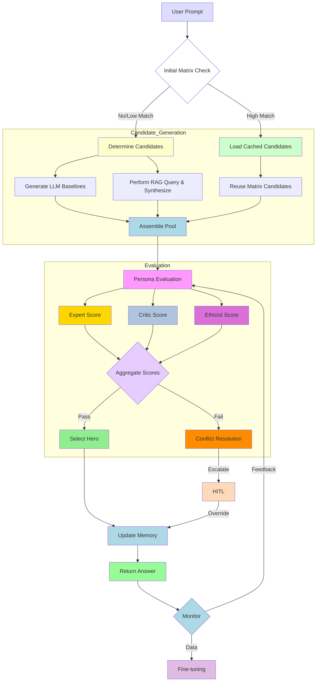
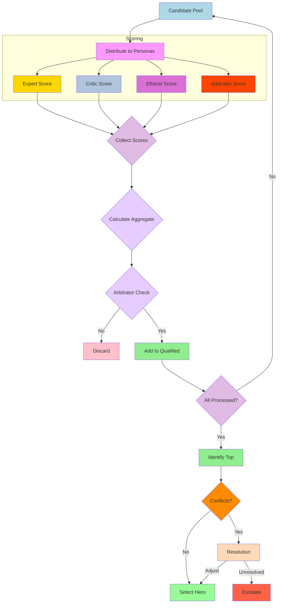
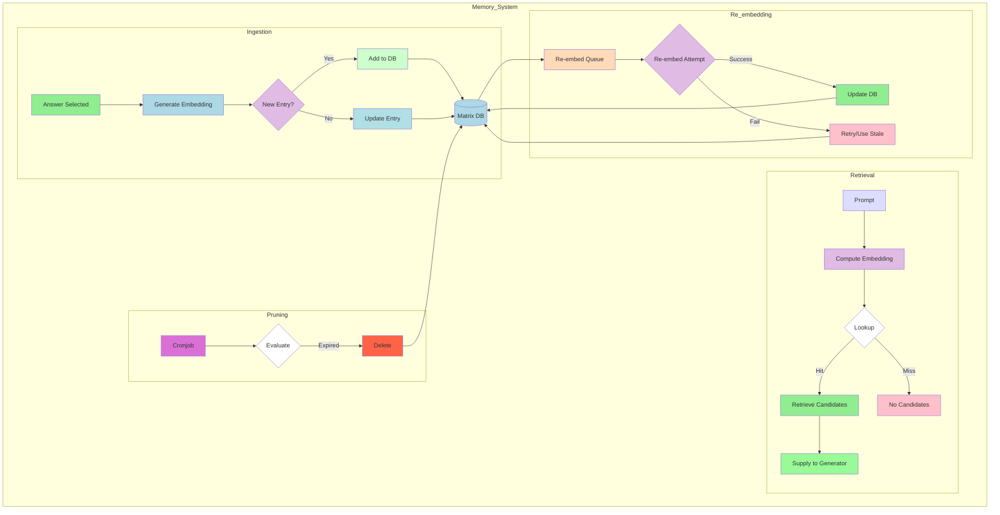

  # HeroLoop 
Whitepaper: HeroLoop: A Meta-Cognitive Engine for Optimal Agent Decision-Making
1. Title Page
Project Name: HeroLoop: A Meta-Cognitive Engine for Optimal Agent Decision-Making
Author(s): Intro
Affiliation: Independent Research
Date: v1.0 — July 2025
License Summary: Covered under CC BY-NC-SA 4.0. Refer to Section 12 for full details.
2. Abstract
HeroLoop presents a novel meta-cognitive architecture designed to significantly elevate the quality, reliability, and efficiency of Large Language Model (LLM) outputs. Addressing the inherent limitations of vanilla LLMs, Chain-of-Thought (CoT), and Retrieval-Augmented Generation (RAG) in complex, dynamic scenarios, HeroLoop introduces a sophisticated feedback loop. It dynamically generates multi-source candidates, evaluates them through diverse persona-based scoring, and leverages an intelligent, self-evolving Matrix Memory for context reuse and continuous learning. By optimizing token cost, minimizing latency, and actively mitigating common failure modes like hallucination and over-reliance, HeroLoop pioneers a more robust and adaptable framework for next-generation AI agents. Furthermore, HeroLoop is designed for selective engagement, allowing users to activate its advanced capabilities only when complex reasoning is truly required, thereby optimizing token usage for simpler queries.
3. Table of Contents
 * Title Page
 * Abstract
 * Table of Contents
 * Problem Statement / Motivation
 * Proposed Solution — HeroLoop
 * Architecture Design
   6.1. Functional Blocks
   6.2. Component Roles
   6.3. Flow Diagrams
   6.4. Pseudocode Snippets
 * Technical Specifications
   7.1. Matrix Memory Data Structure
   7.2. Candidate Retrieval Logic
   7.3. Persona Scoring Logic
   7.4. Memory Reuse Rules
   7.5. Invalidation TTL & Cost-Saving Metrics
   7.6. Dynamic Candidate Generation x and Source Proportions
   7.7. "Similar Context" Detection
   7.8. Persona Scoring Aggregation
   7.9. Matrix Pruning and Evolution
   7.10. Failure Modes and Quality Control
   7.11. Granularity and Scalability
 * Benchmarking / Evaluation Plan
 * Comparative Analysis
 * Use Cases / Applications
 * Modularity & Integration
 * Licensing & Governance
 * Risks & Limitations
 * Roadmap
 * Acknowledgments
 * Appendices
4. Problem Statement / Motivation
Despite remarkable advancements, standalone Large Language Models (LLMs) and even enhanced techniques like Chain-of-Thought (CoT) prompting and Retrieval-Augmented Generation (RAG) face critical limitations in delivering consistently optimal and contextually grounded responses for complex, real-world agentic tasks.
Current challenges include:
 * Hallucination & Factual Inaccuracy: LLMs can generate plausible but factually incorrect information, particularly when knowledge is not directly available in their training data or external retrieval is insufficient.
 * Lack of Self-Correction: Vanilla LLMs and basic RAG lack intrinsic mechanisms for iterative self-assessment and refinement of their own outputs, leading to suboptimal or biased answers.
 * Contextual Brittleness: While RAG improves grounding, it often relies on static retrieval, failing to leverage dynamic historical context or adapt to evolving interaction nuances.
 * Suboptimal Decision-Making: For complex problems requiring multi-faceted analysis, a single LLM's perspective or a simple chain of thoughts is often insufficient to capture the breadth of considerations needed for optimal outcomes.
 * Inefficient Resource Use: Engaging complex reasoning mechanisms for simple, straightforward queries (e.g., "What is 1+1?") unnecessarily consumes high tokens and increases latency.
 * Lack of Meta-Cognition: Existing systems rarely possess a high-level "awareness" of their own performance, limitations, or the quality of their generated candidates.
The burgeoning field of AI agents, autonomous systems, and advanced conversational interfaces urgently demands a more robust, reliable, and intelligent core. HeroLoop addresses these fundamental issues by introducing a meta-cognitive architecture that continuously evaluates, learns from, and refines its own decision-making process, while providing control to the user to engage this advanced capability only when needed.
5. Proposed Solution — HeroLoop
HeroLoop is a meta-cognitive engine that augments LLMs with an intelligent feedback loop, designed to achieve optimal decision-making and response generation. It transcends traditional LLM pipelines by simulating an internal "thought process" involving multiple perspectives, dynamic knowledge integration, and self-improving memory.
What it is: HeroLoop is a configurable, modular AI framework that wraps around existing LLMs, enhancing their output quality, reliability, and efficiency for complex agentic tasks. It's an intelligent orchestrator of AI components, not a standalone LLM. Its activation can be controlled by the user, allowing for token and latency optimization for simpler queries.
How it works (Core Differentiators):
 * Multi-Source Candidate Generation: Unlike systems relying on a single LLM output or basic RAG, HeroLoop dynamically generates a diverse pool of candidate responses from generative LLMs, RAG, and its own evolving Matrix Memory.
 * Persona-Based Multi-Perspective Evaluation: Candidates are judged by a configurable set of "personas," each embodying a distinct viewpoint or expertise (e.g., "Expert," "Critic," "Ethicist"). This simulates multi-stakeholder review, identifying strengths and weaknesses from varied angles.
 * Intelligent Matrix Memory: A dynamic, self-evolving knowledge base that stores past successful candidates, their metadata, persona scores, and associated contexts. It's a "cognitive cache" that enables intelligent reuse, avoids redundant computation, and informs future decisions.
 * Meta-Selection with Arbitration: A sophisticated aggregation mechanism, including a critical "Arbitrator" override, ensures the selection of the most robust and optimal "Hero Answer" from the pool of candidates, not just the most "plausible."
 * Adaptive Optimization: Through continuous feedback loops, including Bayesian Optimization of persona weights and HITL feedback, HeroLoop learns and adapts, systematically improving its performance over time.
 * Selective Engagement: HeroLoop's advanced capabilities can be toggled on or off by the user. For simple queries, a direct LLM call suffices, saving tokens and reducing latency. For complex, ambiguous, or critical tasks, HeroLoop's full meta-cognitive power can be unleashed.
Why it’s different: HeroLoop moves beyond mere information generation to cognitive optimization. It embodies a form of machine metacognition, where the system actively thinks about its own thinking, learns from its outcomes, and self-corrects, ensuring a higher standard of output reliability and intelligence.
6. Architecture Design
HeroLoop's architecture is a layered, modular system designed for robustness, scalability, and continuous improvement.
6.1. Functional Blocks
The core workflow can be visualized as a cyclical process:
 * Input & Pre-processing: User prompt received.
 * Matrix Context Check: Query Matrix Memory for similar past contexts/candidates.
 * Candidate Generation: Dynamically generate x candidates from LLM, RAG, and Matrix sources.
 * Persona Evaluation: All candidates are scored by multiple personas.
 * Hero Selection & Arbitration: Aggregate scores, apply arbitrator override, select Hero Answer.
 * Matrix Update: Store Hero Answer and metadata in Matrix Memory.
 * Output: Deliver Hero Answer to user.
6.2. Component Roles
 * Prompt Handler: Receives user queries, computes prompt_entropy, and initiates the HeroLoop process (or a direct LLM call if HeroLoop is disengaged).
 * Candidate Generator: Orchestrates the creation of diverse candidate responses.
   * LLM Interface: Connects to the core LLM (local or cloud API) for generating baselines.
   * RAG System: Interfaces with external knowledge bases/vector stores for retrieval.
   * Matrix Memory Manager: Queries the Matrix for reusable candidates.
 * Persona Orchestrator: Manages the lifecycle of persona evaluations.
   * Persona Models: Individual LLM instances or specialized prompts configured to embody specific viewpoints (e.g., Expert, Critic, Ethicist).
 * Score Aggregator & Selector: Computes composite scores, applies weighting, manages tie-breaking, and enforces Arbitrator disqualification.
 * Matrix Memory: The persistent, intelligent data store for past interactions, candidates, and metadata.
   * Embedding Service: Generates semantic embeddings for prompts and candidates.
   * Vector Database (FAISS/similar): For efficient similarity search.
   * Persistent Storage: For the actual data structure.
 * Quality Control & Feedback Loop: Monitors performance, detects failures, triggers HITL, and feeds data for automated tuning.
6.3. Flow Diagrams
The following diagrams illustrate the core workflows of HeroLoop.
1. HeroLoop Core Workflow

2. Persona Evaluation Process

3. Matrix Memory Lifecycle

6.4. Pseudocode Snippets
# Pseudocode for Dynamic Candidate Source Distribution
def distribute_sources(x, user_input, matrix_hits):
    a, b, c = 0, 0, 0

    if user_input:
        a = user_input.get("a", None)
        b = user_input.get("b", None)
        c = user_input.get("c", None)

    # If any are None, apply default split
    if a is None or b is None or c is None:
        if matrix_hits == 0:
            a = a if a is not None else int(x * 0.5)
            b = b if b is not None else x - a
            c = 0
        else:
            a = a if a is not None else int(x * 0.3)
            b = b if b is not None else int(x * 0.35)
            c = c if c is not None else x - a - b

    # Adjust if sources fall short
    actual_c = min(c, matrix_hits)
    unused = c - actual_c
    a += unused // 2
    b += unused - (unused // 2)

    return a, b, actual_c

# Pseudocode for Hero Answer Selection (Simplified)
def select_hero_answer(candidates, persona_scores, persona_weights, arbitrator_threshold):
    qualified_candidates = []
    for cand in candidates:
        arbitrator_score = persona_scores[cand.id].get("Arbitrator", 0)
        if arbitrator_score >= arbitrator_threshold:
            qualified_candidates.append(cand)

    if not qualified_candidates:
        # Trigger HITL or "unconfident response"
        return None, "No confident candidate found."

    max_score = -1
    hero_candidate = None
    for cand in qualified_candidates:
        aggregate_score = sum(persona_weights.get(p_name, 1.0) * score for p_name, score in persona_scores[cand.id].items() if p_name != "Arbitrator")
        cand.aggregate_score = aggregate_score

        if aggregate_score > max_score:
            max_score = aggregate_score
            hero_candidate = cand
        elif aggregate_score == max_score:
            # Apply tie-breakers: Clarity, then Freshness
            current_clarity = calculate_clarity(cand, persona_scores)
            hero_clarity = calculate_clarity(hero_candidate, persona_scores)
            if current_clarity > hero_clarity:
                hero_candidate = cand
            elif current_clarity == hero_clarity:
                current_freshness = calculate_freshness(cand)
                hero_freshness = calculate_freshness(hero_candidate)
                if current_freshness > hero_freshness:
                    hero_candidate = cand
    return hero_candidate, "Success"

# Helper functions for tie-breakers (conceptual, not full implementation)
def calculate_clarity(candidate, persona_scores):
    # Example: inverse variance of persona scores * readability score
    scores = [s["score"] for p, s in persona_scores[candidate.id].items() if p != "Arbitrator"]
    if len(scores) < 2: return 0.0 # Cannot calculate variance with less than 2 scores
    variance = sum((x - (sum(scores) / len(scores))) ** 2 for x in scores) / len(scores)
    readability_score = 0.5 # Placeholder, would use Flesch-Kincaid etc.
    return (1.0 / (variance + 0.01)) * readability_score # Add small epsilon to avoid div by zero

def calculate_freshness(candidate):
    # Example: 1 / (days_since_last_used + 1)
    # Would retrieve from candidate.last_used field
    import datetime
    last_used_date = datetime.datetime.fromisoformat(candidate.last_used.replace('Z', '+00:00')) if hasattr(candidate, 'last_used') else datetime.datetime.now(datetime.timezone.utc)
    days_since_last_used = (datetime.datetime.now(datetime.timezone.utc) - last_used_date).days
    return 1.0 / (days_since_last_used + 1)

7. Technical Specifications
HeroLoop’s technical backbone is designed for efficiency, precision, and adaptability.
7.1. Matrix Memory Data Structure
Each entry in the Matrix Memory is a JSON-serializable object containing:
{
  "id": "candidate_hash_unique_id",
  "text": "Generated answer text...",
  "embedding": [0.1, 0.2, ..., 0.9], // Pre-computed semantic vector
  "source": "LLM-gen" | "RAG" | "Matrix-reuse",
  "prompt_hash": "hash_of_original_query", // For direct lookup
  "pros": ["Concise", "Well-cited"],
  "cons": ["Slightly off-topic"],
  "personas": {
    "Expert": {"score": 85, "rationale": "Strong technical detail."},
    "Critic": {"score": 60, "rationale": "Lacks real-world examples."},
    "Ethicist": {"score": 90, "rationale": "Ethically sound argument."}
  },
  "similar_to": ["prompt_hash_A", "prompt_hash_B"], // Relevant prompt contexts
  "last_used": "2025-07-16T01:45:01Z", // Current timestamp for example
  "use_count_since_stale": 0, // For re-embedding safeguard
  "staleness_duration_days": 0, // For re-embedding safeguard
  "hitl_approved": false // Flag for human-validated entries
}

7.2. Candidate Retrieval Logic (Matrix)
 * Prompt Hash Shortcut: On a new prompt, compute prompt_hash. Check if an exact match exists in Matrix. If so, retrieve associated candidates (fastest path).
 * Semantic Search: If no exact prompt_hash match, compute embedding E\_P for the current prompt. Perform a cosine similarity search against stored embedding vectors E\_i in the Matrix.
   * sim = cosine(E_P, E_i)
   * If sim $\ge \theta$ (e.g., 0.85), the context is "similar enough," and relevant candidates are loaded.
   * Dynamic Adjustment of \\theta: $\theta$ can be lowered (e.g., 0.80 for high-recall mode) or raised (e.g., 0.90 for high-precision mode) via runtime configuration, determined through ROC analysis on a validation set.
 * FAISS Indexing: For efficient similarity search over large indices (N \\le 10k entries), FAISS (or similar vector database) is used, leveraging GPU for sub-100ms latency.
 * Lazy Re-embedding Fallback: If re-embedding a legacy entry takes \>50 ms or errors, the entry is skipped for the current query, queued for async re-embedding, and used with its stale embedding (if within TTL threshold). If use_count_since_stale $\ge 5$ or stale_duration_days $\ge 3$, a forced synchronous re-embedding is triggered on the next use, regardless of system load.
7.3. Persona Scoring Logic
 * Score Range: Each persona outputs a numeric score from 0 to 100.
 * Rationale Text: Optional qualitative text explaining the score, stored for meta-learning and auditing.
 * Clarity Metric: Clarity = (1 / variance(persona_scores)) * average(readability_score). Readability score (e.g., Flesch-Kincaid) is calculated on the candidate text. Variance is computed from the numerical scores of all non-Arbitrator personas for a given candidate.
 * Freshness Metric: Freshness = 1 / (days_since_last_used + 1).
7.4. Memory Reuse Rules
 * Candidates from Matrix reuse (c source) are prioritized in candidate generation if they meet the sim $\ge \theta$ threshold.
 * hitl_approved = true candidates are given a slight preference in the aggregation phase or by increased default weights.
 * "Past winners" (high-score entries from Matrix) can be fed into new prompts as bonus candidates.
7.5. Invalidation TTL & Cost-Saving Metrics
 * Time-To-Live (TTL): Each Matrix entry has an auto-expiration window (default 30 days).
* Max Capacity Eviction: If Matrix size exceeds a configurable N (e.g., 10k entries), eviction is based on Least-Recently-Used (LRU) or lowest computed relevance_decay_score.
 * relevance_decay_score: decay = $\alpha \times \text{age_days} + \beta \times (1 - \text{last_similarity})$. High decay implies lower relevance, prioritizing pruning.
 * Cost Impact Monitoring: Expected token billing (x \\times \\text{tokens\_per\_candidate}) is monitored, with mitigation strategies like LLM_soft_cap (auto-throttle LLM baselines to \\le 50% of x) and Grounding_penalty (injecting a "grounding prompt" if RAG/matrix sources are low) to control costs.
7.6. Dynamic Candidate Generation x and Source Proportions
 * Heuristic Core: x = min(user_limit or system_max, base + complexity_factor * scale).
   * base (e.g., 8) ensures a minimum.
   * complexity_factor is \\lfloor H / 5 \\rfloor, capped at 5, where H is prompt Shannon token entropy. user_limit is typically 1-64, system_max is 128.
   * scale tunes expansion aggression.
 * Token Entropy Calculation: H = -\\sum\_{t \\in T} P(t),\\log P(t), where P(t) = \\frac{\\text{Count of token } t \\text{ in prompt}}{\\text{Total tokens in prompt}}. Uses the same tokenizer as the deployed LLM (e.g., BPE for GPT-family, WordPiece for T5/BERT, SentencePiece for Mistral). Laplace smoothing is optional for ultra-short prompts.
   * A minimum complexity_factor = 1 is enforced if Total unique tokens < 5 and Token type diversity $\ge$ threshold to mitigate tokenizer simplification risks. Reliable entropy is typically achieved for prompts \\ge 20 tokens.
 * Proportional Breakdown (Defaults): a \\approx 30% \\text{ of } x, b \\approx 35% \\text{ of } x, c \\approx 35% \\text{ of } x. These ratios can be tuned per domain or user-overridden.
 * Fill-Until-Complete: If a source cannot provide its share, others compensate to reach x. Over-reliance risk on LLM is mitigated by LLM_soft_cap (auto-throttle LLM baselines to \\le 50% of x), Grounding_penalty (injecting a system-role "grounding prompt" if b+c \< 20% of x, unless anti-grounding phrases are detected), and Dynamic_de-weight in scoring if LLM is over-used.
7.7. "Similar Context" Detection
 * Primary: Semantic Embeddings using cosine_similarity($E_P, E_i$) $\ge 0.85$. $\theta$ is determined by ROC analysis and dynamically adjustable.
 * Fallback: MinHash signature of key terms with Jaccard threshold (e.g., 0.6).
 * Hybrid: Both methods combined for robust recall.
7.8. Persona Scoring Aggregation
 * Aggregate Score: S(c) = \\sum\_{i} w\_i \\times \\text{score}\_i(c). Default weights are configurable (e.g., Expert 1.2, Critic 1.0).
 * Hero Pick: Candidate with highest S(c).
 * Tie-breaker: First Clarity, then Freshness.
 * Arbitrator Override: Treated as a critical override. If Arbitrator score for a candidate \< 7.0 \\Rightarrow that candidate is disqualified, regardless of other consensus.
 * Top-3 Shuffle (Conflict Resolution): If conflicts (semantic divergence, cosine < 0.5) or high score variance (max_score_variance > 3.0) are detected, the top-3 candidates can be re-ranked. This involves slightly resetting persona weights (random noise \\pm 5%) and optionally regenerating 1-2 candidates from a new temperature setting, acting as an exploration step akin to simulated annealing.
7.9. Matrix Pruning and Evolution
 * Background Sweep: Hourly Kubernetes cronjob prunes entries. Compute footprint: \<0.5 GPU-seconds per 10k entries (embeddings in RAM).
 * Relevance Decay Score: \\text{decay} = \\alpha \\times \\text{age\_days} + \\beta \\times (1 - \\text{last\_similarity}), where last_similarity is cosine similarity to the most recent prompt the candidate was exposed to.
7.10. Failure Modes and Quality Control
 * Low-Quality RAG: Critic persona automatically flags any RAG answer with score \< 4.0. Mitigation: temporarily set b=0 for the next cycle, log for source Vector DB curation.
 * Contradictory Information: Conflict Detector checks semantic divergence (cosine < 0.5) between top candidates. If a conflict persists after Arbitrator evaluation fails (score < 7.0), an immediate escalation to HITL is triggered. For lesser variance, auto-re-run with adjusted Arbitrator weight (+25%) and candidate shuffling. If still unresolved after 2 cycles, an "unconfident response" is returned.
 * Persona Fatigue: Monitored by tracking persona score drift over time (EWMA). If drift \>\\pm 20%, persona prompts are reset or replaced with updated LLM templates.
7.11. Granularity and Scalability
 * Resource Footprint: Per candidate/persona: \\sim 200 ms LLM call (cached for baselines), 5 MB GPU RAM. Total for x=20, 5 personas: \\sim 10 s (serial); \<2 s (fully parallel on 4-GPU pod).
 * API Limits: System respects LLM API rate caps, employs back-pressure queues for high concurrency (\>100 concurrent sessions).
 * Human-In-The-Loop (HITL): Triggered if max_score_variance > 3.0 or ethical_score < 5.0. System raises a webhook for human review.
 * HITL Feedback Loop: Human overrides are captured. The winning entry is labeled hitl_approved=true, and its pros/cons scores are boosted by +10%. If overrides for a given persona exceed 20%, that persona’s weight (w\_i) is lowered by 5%. Human-reviewed prompt–hero pairs (threshold \\ge 250 pairs, augmented with synthetic negatives) are bundled weekly into an LLM fine-tune dataset, improving baseline generation for similar future queries. All fine-tune jobs pass through a QA pre-check (no toxic data, no internal prompt leakage, domain balance).
8. Benchmarking / Evaluation Plan
HeroLoop's performance will be rigorously evaluated against established baselines and custom metrics designed to assess its unique capabilities.
 * Evaluation Phases:
   * Component-Level Testing: Isolated evaluation of Matrix Memory recall, persona scoring accuracy against human labels, and candidate generation diversity.
   * End-to-End Performance: Assessment of the full HeroLoop pipeline.
   * Real-World Application Testing: Pilot deployments in target use cases (e.g., customer support) with user satisfaction (CSAT) metrics.
 * Task Types:
   * Complex Q&A: Multi-hop reasoning, open-ended questions.
   * Code Generation & Review: Generating functional code and evaluating its correctness, efficiency, and adherence to best practices.
   * Ethical Dilemma Resolution: Presenting moral ambiguities and evaluating the AI's ability to provide balanced, ethically sound advice.
   * Creative Content Generation: Evaluating originality and coherence.
   * Policy/Legal Reasoning: Analyzing documents and extracting implications.
 * Metrics:
   * Judgment Quality: Aggregate Persona Scores, Arbitrator Pass Rate, Human Expert Agreement Score.
   * Factual Accuracy: Precision and Recall against ground truth (for RAG-heavy tasks).
   * Coherence & Readability: Linguistic quality metrics.
   * Token Cost Reduction: Percentage decrease in LLM API calls/tokens for HeroLoop vs. repeated vanilla LLM calls for similar quality, especially for simple queries where HeroLoop is disengaged.
   * Latency: End-to-end response time under varying loads.
   * Matrix Hit Rate: Percentage of queries served or significantly aided by Matrix Memory reuse.
   * Persona Agreement/Divergence: Variance in persona scores, indicating robustness or potential conflict.
   * Human-in-the-Loop (HITL) Override Rate: Percentage of system decisions requiring human intervention.
   * User Satisfaction (CSAT) & Retention: Measured through explicit ratings and implicit engagement metrics for live deployments.
9. Comparative Analysis
HeroLoop's distinctive architecture positions it favorably against existing LLM augmentation techniques:
| Feature | HeroLoop | RAG+CoT | RLHF (Reinforcement Learning from Human Feedback) |
|---|---|---|---|
| Candidate Pooling | Dynamic, Multi-source (LLM, RAG, Matrix) | Static (LLM output + RAG retrieval) | NA (modifies base model behavior) |
| Memory Reuse | ✅ Intelligent, Semantic, Evolving Matrix | ❌ Limited to current RAG context | ❌ (Implicit, via model weights) |
| Persona Simulation | ✅ Explicit Multi-LLM Roles for Scoring | ❌ Single model perspective | ❌ (Implicit, via reward model) |
| Meta-Selection | ✅ Weighted Aggregation + Arbitrator Override | ❌ Simple best-of-N or single output | ✅ (Reward Model guides selection) |
| Self-Correction | ✅ Iterative via Persona feedback & Matrix | ❌ Manual prompt refinement only | ✅ (Via reward signal, but often slow) |
| Cost Opt. (Reuse) | ✅ High (via Matrix reuse & selective engagement) | 🟡 Moderate (RAG retrieval adds cost) | 🟡 Moderate (Multiple generations for ranking) |
| Conflict Resolution | ✅ Explicit Arbitration & Shuffle | ❌ Ad-hoc, prompt-based | ❌ Implicit, via reward signal |
| Continual Learning | ✅ Via Matrix & Automated Persona Tuning | ❌ Manual updates to RAG DB or prompts | 🟡 Slow, costly fine-tuning cycle |
Qualitative Comparison:
 * RAG + CoT: Provides grounding and step-by-step reasoning but lacks systematic self-correction or multi-perspective evaluation. Its memory is external (RAG DB) and not intrinsically self-improving based on past successes/failures.
 * RLHF: Improves alignment and safety by training an LLM based on human preferences. However, it's a slow, resource-intensive, and offline process. It doesn't offer real-time, multi-perspective evaluation or dynamic context reuse in the same manner as HeroLoop. It fundamentally changes the base model, whereas HeroLoop is an orchestration layer.
HeroLoop's unique strength lies in its active, real-time, and multi-faceted internal evaluation loop, combined with a self-evolving contextual memory. This allows it to learn during inference, dynamically adapt to query complexity, and systematically refine its output quality, offering a more robust and intelligent solution than current state-of-the-art methods.
10. Use Cases / Applications
HeroLoop's meta-cognitive capabilities enable its application across a broad spectrum of advanced AI systems:
 * Intelligent AI Assistants & Customer Support: Provide highly accurate, empathetic, and context-aware responses to complex user queries, reducing escalations and improving customer satisfaction. Can act as a tiered support system, escalating to HITL only when necessary.
 * Dynamic Research Agents: Automate complex research tasks, synthesizing information from diverse sources, evaluating findings from multiple "expert" perspectives, and generating comprehensive reports. Ideal for market analysis, scientific literature review, and due diligence.
 * Legal and Medical Reasoning Bots: Augment legal or medical professionals by providing case summaries, legal precedent analysis, or differential diagnoses, with "compliance" and "ethical" personas ensuring adherence to strict regulations and best practices.
 * Reinforcement Learning (RL) Pipelines: Enhance the "thinking" component of RL agents, allowing them to generate and evaluate multiple action plans, predict consequences via simulated "critics," and select optimal strategies before execution in complex environments.
 * Autonomous Planning Systems: Power intelligent agents for logistics, resource allocation, or complex project management by generating diverse plans, simulating potential outcomes with "risk assessment" personas, and selecting the most robust and efficient path.
 * Creative & Generative AI Systems: Improve the quality of generated content (e.g., stories, designs, music) by passing initial outputs through "creativity," "marketability," and "audience reception" personas, ensuring the final product aligns with artistic and strategic goals.
 * Personalized Learning & Tutoring Systems: Dynamically generate learning paths, explanations, and exercises tailored to individual student needs, evaluated by "pedagogue" and "student feedback" personas to optimize learning outcomes.
11. Modularity & Integration
HeroLoop is designed as a highly modular and extensible framework, enabling seamless integration into existing or new AI pipelines.
 * Plug-and-Play Design:
   * LLM Agnostic: HeroLoop can wrap around any LLM backend (e.g., Google Gemini, OpenAI GPT-series, open-source models like Llama, Mistral) by configuring the LLM Interface component.
   * RAG Agnostic: Compatible with various vector databases (e.g., Pinecone, Weaviate, Milvus) and document stores.
   * Persona Flexibility: New personas can be added or existing ones modified by defining new LLM prompts and weights without altering the core architecture.
 * Integration Strategy:
   * HeroLoop operates as an intelligent middleware or an API service that sits between the user/application and the underlying LLM/RAG infrastructure.
   * It can be deployed as microservices, allowing individual components (e.g., Candidate Generator, Persona Orchestrator, Matrix Memory) to scale independently.
 * API Sketch:
   A typical interaction with HeroLoop would involve:
   * /run-heroloop:
     * Method: POST
     * Body: {"prompt": "string", "user_config": {"x_limit": int, "source_weights": {"a": float, "b": float, "c": float}, "heroloop_enabled": true}}
     * Response: {"hero_answer": "string", "metadata": {"chosen_candidate_id": "string", "aggregate_score": float, "persona_scores": {...}, "source": "string"}}
   * /matrix-update: (Internal/Admin API for explicit updates/invalidation)
     * Method: POST
     * Body: {"candidate_data": {...}, "action": "add" | "invalidate"}
     * Response: {"status": "success"}
   * /get-metrics: (For monitoring and performance)
     * Method: GET
     * Response: {"cost_metrics": {...}, "latency_metrics": {...}, "hitl_rate": float}
 * System Resource Requirements:
   * CPU: Moderate, for orchestration logic, API handling, and basic data processing.
   * RAM: Moderate, for application runtime and in-memory Matrix caching (if applicable).
   * GPU: Varies. If using cloud LLM APIs, local GPU needs are minimal. If hosting LLMs and vector databases locally, significant high-VRAM GPUs are required (e.g., 24GB+ per model).
   * Network: High bandwidth, low latency connection to LLM APIs and RAG sources is critical for performance.
12. Licensing & Governance
HeroLoop is conceived with a commitment to fostering responsible AI development and collaborative innovation.
 * Current License: The conceptual framework and any associated initial code snippets are currently released under the Creative Commons Attribution-NonCommercial-ShareAlike 4.0 International (CC BY-NC-SA 4.0) License.
   * Attribution: You must give appropriate credit, provide a link to the license, and indicate if changes were made. You may do so in any reasonable manner, but not in any way that suggests the licensor endorses you or your use.
   * NonCommercial: You may not use the material for commercial purposes.
   * ShareAlike: If you remix, transform, or build upon the material, you must distribute your contributions under the same license as the original.
 * Future Plans:
   * Open-Source Release: Depending on community interest and development trajectory, a future iteration might explore a more permissive open-source license (e.g., MIT or Apache 2.0) to encourage broader adoption and contribution, potentially in a dual-license model with a commercial option.
   * Commercial Dual License: For commercial applications, a separate proprietary license would be available, allowing for commercial use without the "NonCommercial" or "ShareAlike" restrictions of CC BY-NC-SA 4.0.
   * Research Framework: HeroLoop aims to evolve into a collaborative research framework, inviting contributions from the AI community to enhance its personas, matrix intelligence, and failure mitigation strategies.
 * Governance Plan (Optional - if growing into a framework):
   If HeroLoop develops into a broader research framework or open collective, a formal governance model will be established, including:
   * Core Contributors: A steering committee to guide strategic development.
   * Community Contributions: Clear guidelines and review processes for external contributions.
   * Ethical Review Board: To continuously assess and guide the ethical implications of the framework's evolution and applications.
13. Risks & Limitations
Despite its advantages, HeroLoop, like any advanced AI system, is subject to inherent risks and limitations:
 * Computational Cost & Latency (despite optimizations): While optimized, generating and evaluating multiple candidates, especially with numerous personas and complex RAG queries, will always be more resource-intensive and potentially slower than a single, direct LLM call. This makes it unsuitable for ultra-low-latency, high-volume trivial tasks (e.g., 1+1 calculation), where HeroLoop should be explicitly disengaged.
 * Complexity & Debugging: The intricate interplay of dynamic candidate generation, persona logic, and matrix dynamics can make system behavior difficult to fully predict, debug, and fine-tune, requiring sophisticated monitoring tools.
 * Data Quality Dependency: The effectiveness of RAG and Matrix Memory reuse is directly dependent on the quality, relevance, and representativeness of the underlying data sources. "Garbage in, garbage out" still applies.
 * Persona Engineering & Bias: The quality of persona outputs relies heavily on careful prompt engineering. Poorly designed personas can introduce or amplify biases present in the base LLM or lead to suboptimal evaluations. Automated tuning helps but requires careful objective function design.
 * Scalability of Matrix Memory: While FAISS aids, scaling the Matrix Memory to truly massive datasets (billions of entries) while maintaining sub-100ms latency can still present engineering challenges, potentially requiring distributed vector databases.
 * "Cognitive Overload" (Self-Contradiction): Although the Arbitrator persona is designed to mitigate it, highly complex or ambiguous prompts could theoretically lead to situations where personas fundamentally contradict each other, making confident Hero Answer selection difficult.
 * Human-in-the-Loop Burden: While reducing HITL frequency, complex edge cases or persistent failures could still generate a significant volume of tasks for human reviewers.
14. Roadmap
HeroLoop's development will proceed in phases, focusing on iterative improvement and expanded capabilities.
 * HeroLoop v1.0 (Current Stage - Conceptual & Core Logic):
   * Fully defined cognitive architecture.
   * Detailed workflow for candidate generation, persona scoring, and matrix management.
   * Initial pseudocode for core logic (e.g., distribute_sources).
   * Clear problem statement, advantages, and use cases.
 * HeroLoop v1.1 (Minimum Viable Prototype - Q4 2025):
   * Reference implementation using common LLM APIs (e.g., Google Gemini, OpenAI GPT) and open-source vector DBs (e.g., FAISS).
   * Basic configurable personas.
   * Functional Matrix Memory for caching and reuse.
   * Initial monitoring for token cost and latency.
 * HeroLoop v1.2 (Enhanced Core & Feedback - Q2 2026):
   * Integration of Relevance Decay and advanced pruning strategies.
   * First iteration of automated Persona Tuning via Bayesian Optimization.
   * Refined HITL integration with comprehensive feedback loops for LLM fine-tuning.
   * Pre-built persona templates for common use cases.
 * HeroLoop v2.0 (Full Agentic Capability & Robustness - Q4 2026):
   * Full implementation of Arbitrator persona and conflict resolution dynamics.
   * Advanced prompt entropy and complexity adaptive scaling.
   * Support for multi-modal inputs/outputs.
   * Optimized for edge deployment where feasible (e.g., smaller, distilled personas).
   * Comprehensive API blueprint and SDK.
 * Future Expansions (2027+):
   * RL Integration: Direct feedback mechanisms with reinforcement learning environments for agent training.
   * Distributed Matrix Memory: Scaling the Matrix to petabyte-scale knowledge bases.
   * Hardware Acceleration Integration: Deeper integration with specific hardware architectures for maximum efficiency.
   * Explainable AI (XAI) Module: Enhanced transparency into persona decision-making and Hero Answer selection.
15. Acknowledgments
This conceptualization of HeroLoop draws inspiration from foundational work in cognitive architectures, large language model advancements, Retrieval-Augmented Generation techniques, and the burgeoning field of AI agent research. Special acknowledgment to the open-source communities and research labs pushing the boundaries of AI capabilities.
16. Appendices
(Note: In a final whitepaper, this section would contain extended code, more detailed diagrams, and a glossary.)
 * Appendix A: Extended Pseudocode:
   * Detailed pseudocode for calculate_clarity, calculate_freshness, compute_prompt_entropy, detect_conflict, and matrix_pruning_sweep.
 * Appendix B: Glossary of Terms:
   * Definitions for key terms: Persona, Matrix Memory, RAG, CoT, etc.
 * Appendix C: Sample Persona Definitions:
   * Example prompts for "Expert," "Critic," and "Ethicist" personas.